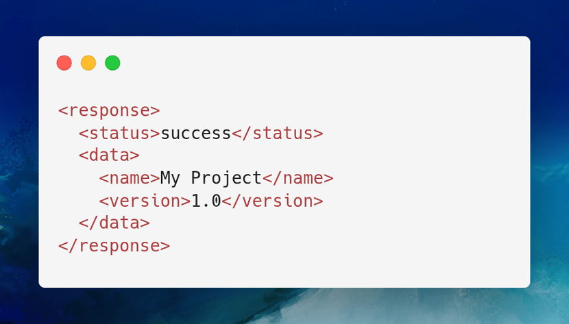

<p align="center">
    <a href="https://github.com/yiisoft" target="_blank">
        
    </a>
    <h1 align="center">Yii API application</h1>
    <h3 align="center">An application template for a new API project</h3>
    <br>
</p>

[](https://packagist.org/packages/yiisoft/app-api)
[](https://packagist.org/packages/yiisoft/app-api)
[](https://github.com/yiisoft/app-api/actions/workflows/build.yml)
[](https://codecov.io/gh/yiisoft/app-api)
[](https://github.com/yiisoft/app-api/actions?query=workflow%3A%22static+analysis%22)
[](https://shepherd.dev/github/yiisoft/app-api)
[](https://shepherd.dev/github/yiisoft/app-api)

<p>
    <a href="https://github.com/yiisoft/app-api" target="_blank">
        
    </a>
</p>

The package is an API application template. If you need console only or classic web please start with corresponding
templates:

- [Console application template](https://github.com/yiisoft/app-console)
- [Web application template](https://github.com/yiisoft/app)

## Requirements

- PHP 8.2 - 8.5.

## Installation

### Local installation

If you do not have [Composer](https://getcomposer.org/), you may install it by following the instructions
at [getcomposer.org](https://getcomposer.org/doc/00-intro.md).

Create a project:

```shell
composer create-project yiisoft/app-api myproject
cd myproject
```

> [!NOTE]
> Ensure that Composer is executed with the same PHP version that will be used to run the application.

Copy the example environment file and adjust as needed:

```shell
cp .env.example .env
```

To run the app:

```shell
composer serve
```

This starts RoadRunner using [yiisoft/yii-runner-roadrunner](https://github.com/yiisoft/yii-runner-roadrunner).
The application listens on `http://localhost:8080` by default.

> [!TIP]
> The `.env` file is for local development only and is excluded from version control.
> In production, configure environment variables via your server or container instead.

### Installation with Docker

> [!WARNING]
> Docker compose version 2.24 or above is required.

Fork the repository, clone it, then:

```shell
cd myproject
make composer update
```

To run the app:

```shell
make up
```

To stop the app:

```shell
make down
```

The application is available at `http://localhost:9991` by default.

The benchmarkable PostgreSQL endpoint is available at `/postgres/orders`. It reads recent joined rows from seeded
`orders` and `customers` tables through `yiisoft/db-pgsql` using a persistent PDO connection.

Use `make bench` to benchmark `/` only, and `make bench-db` to benchmark `/postgres/orders` only. The latter gives an
isolated RPS number for the database-backed endpoint.

Both targets accept `BENCH_NAME="..."`, `MODE=steady|ramp` and `CAPTURE_METRICS=0|1`. The default benchmark name is
`FrankenPHP classic`. When `CAPTURE_METRICS=1`, the run stores time-series metrics in `runtime/benchmarks/`:
`k6-timeseries.json` for compact request/latency/failure series, `summary.json` for the aggregate k6 summary,
`docker-stats.csv` for container CPU and memory samples, and `metadata.env` for the exact run settings.
Runtime k6 warnings are suppressed by default with `K6_LOG_OUTPUT=none` so a failing target does not flood the
console; use `K6_LOG_OUTPUT=stderr` to restore k6 log output when debugging.

By default, the benchmark runner auto-sizes `PREALLOCATED_VUS` and `MAX_VUS` from the configured request rate. For
steady mode it uses `RATE`; for ramp mode it uses the highest target found in `STAGES`. You normally do not need to
set VU counts manually, but both variables still work as explicit overrides. The default heuristic is intentionally
aggressive and now prefers lower dropped-iteration rates over conservative VU usage. `AUTO_MAX_VUS_LIMIT` may be used
as a higher or lower automatic safety ceiling when needed.

Examples:

```shell
make bench
make bench-db RATE=8000
make bench MODE=ramp
make bench-db MODE=ramp CAPTURE_METRICS=1
make bench-db BENCH_NAME="FrankenPHP worker" MODE=ramp CAPTURE_METRICS=1
make bench PREALLOCATED_VUS=500 MAX_VUS=3000
```

To turn one or more captured runs into a self-contained HTML report with graphs for RPS, failure rate, latency, dropped
iterations, CPU, and memory:

```shell
make bench-report
make bench-report runtime/benchmarks
make bench-report runtime/benchmarks/<run-dir>
make bench-report runtime/benchmarks/<run-dir-1> runtime/benchmarks/<run-dir-2>
```

Other make commands are available in the `Makefile` and can be listed with:

```shell
make help
```

## Directory structure

The application template has the following structure:

```
config/                     Configuration files.
    common/                 Common configuration and DI definitions.
    console/                Console-specific configuration.
    environments/           Environment-specific configuration (dev/test/prod).
    web/                    Web-specific configuration.
docker/                     Docker-specific files.
public/                     Files publically accessible from the Internet.
runtime/                    Files generated during runtime.
src/                        Application source code.
    Api/                    API action handlers and API-specific code.
        Shared/             Shared API components (middleware, presenters, factories).
    Console/                Console commands.
    Shared/                 Code shared between API and console applications.
    bootstrap.php           Application bootstrap (autoloading, environment setup).
    Environment.php         Environment configuration class.
tests/                      A set of Codeception tests for the application.
    Api/                    API endpoints tests.
    Console/                Console command tests.
    Functional/             Functional tests.
    Unit/                   Unit tests.
vendor/                     Installed Composer packages.
Makefile                    Config for make command.
worker.php                  RoadRunner worker entry point.
yii                         Console application entry point.
```

## Testing

The template comes with ready to use [Codeception](https://codeception.com/) configuration.
To execute tests, in local installation run:

```shell
./vendor/bin/codecept build

APP_ENV=test composer serve > ./runtime/yii.log 2>&1 &
./vendor/bin/codecept run
```

For Docker:

```shell
make codecept build
make codecept run
```

The Docker environment also starts PostgreSQL and seeds realistic benchmark data from
`docker/postgres/initdb.d/10-benchmark.sql`. To regenerate that dump:

```shell
make generate-pgsql-dump
```

## Static analysis

The code is statically analyzed with [Psalm](https://psalm.dev/). To run static analysis:

```shell
./vendor/bin/psalm
```

or, using Docker:

```shell
make psalm
```

## Support

If you need help or have a question, check out [Yii Community Resources](https://www.yiiframework.com/community).

## License

The Yii3 API template is free software. It is released under the terms of the BSD License.
Please see [`LICENSE`](./LICENSE.md) for more information.

Maintained by [Yii Software](https://www.yiiframework.com/).

## Support the project

[](https://opencollective.com/yiisoft)

## Follow updates

[](https://www.yiiframework.com/)
[](https://twitter.com/yiiframework)
[](https://t.me/yii3en)
[](https://www.facebook.com/groups/yiitalk)
[](https://yiiframework.com/go/slack)
